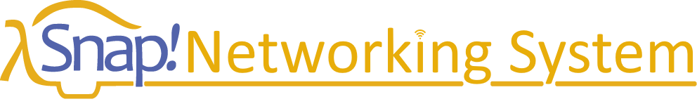
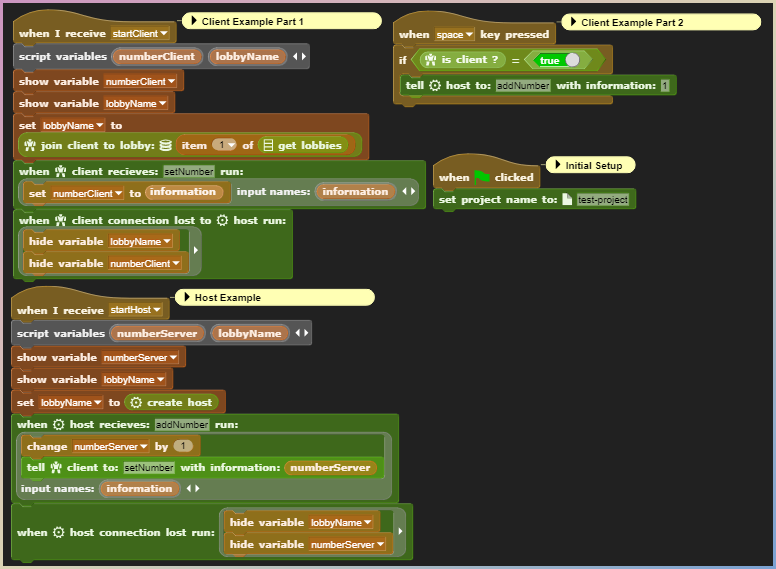
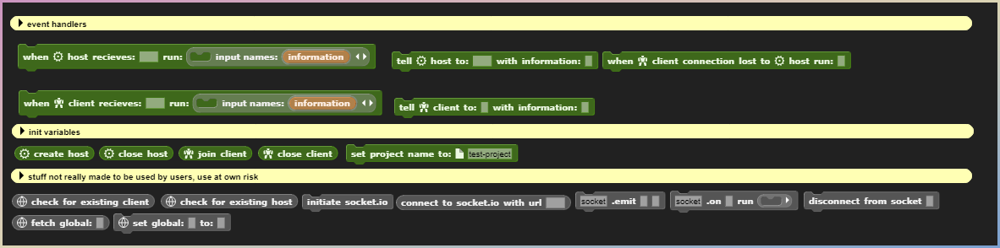

[![Contributors][contributors-shield]][contributors-url]
[![Forks][forks-shield]][forks-url]
[![Stargazers][stars-shield]][stars-url]
[![Issues][issues-shield]][issues-url]
[![MIT License][license-shield]][license-url]

> Snap<i>!</i> Networking System is an addition to the Snap<i>!</i> block coding editor. This allows you to have networking capabilities and easy to use matchmaking. This project is currently in development, thank you!

---

## Try it out
The example project is not yet out as the product is not yet finalized. This should be updated to a link of the Networking System inside of Snap<i>!</i>. Thank you for your paitence and understanding.

## Notice
All images shown are concept and not yet finalized. There may be changed features, or an entirely new design all together. Thank you for understanding.

## Example(s)

## Roadmap

- [ ] Basic Connection System for Client and Host
- [ ] Ability to communicate from Client and Host
- [ ] Advanced features for speaking to specific clients
- [ ] Statistic managing system
- [ ] Free to use hosting 24/7

## Hosting
Snap<i>!</i> Networking System was made for multiple projects being able to work in one namespace. This allows for a diversity of projects with a small need for procession power and multiple servers. Snap<i>!</i> Networking System only requires **ONE** server to host as of last edit, and plans for free hosting have already been made.

## Licensing
Snap<i>!</i> Networking System is 100% MIT. What does this mean? You are allowed to modify, sell, reuse our code in any way, shape or form with no liability. The more creativity, the better!

## Issues & Concerns
Have any bugs, concerns, or suggestions? Feel free to either make an issue request or if you have a solution to a problem, maybe even a pull request. Thank you!

## Endorsement
Snap<i>!</i> is not endorsed or officially made by snap.berkeley.edu. Thank you for understanding.

[contributors-shield]: https://img.shields.io/github/contributors/HooferDevelops/snap-advanced-multiplayer-system.svg?style=flat-square
[contributors-url]: https://github.com/HooferDevelops/snap-advanced-multiplayer-system/graphs/contributors
[forks-shield]: https://img.shields.io/github/forks/HooferDevelops/snap-advanced-multiplayer-system.svg?style=flat-square
[forks-url]: https://github.com/HooferDevelops/snap-advanced-multiplayer-system/network/members
[stars-shield]: https://img.shields.io/github/stars/HooferDevelops/snap-advanced-multiplayer-system.svg?style=flat-square
[stars-url]: https://github.com/HooferDevelops/snap-advanced-multiplayer-system/stargazers
[issues-shield]: https://img.shields.io/github/issues/HooferDevelops/snap-advanced-multiplayer-system.svg?style=flat-square
[issues-url]: https://github.com/HooferDevelops/snap-advanced-multiplayer-system/issues
[license-shield]: https://img.shields.io/github/license/HooferDevelops/snap-advanced-multiplayer-system.svg?style=flat-square
[license-url]: https://github.com/HooferDevelops/snap-advanced-multiplayer-system/blob/master/LICENSE.txt
